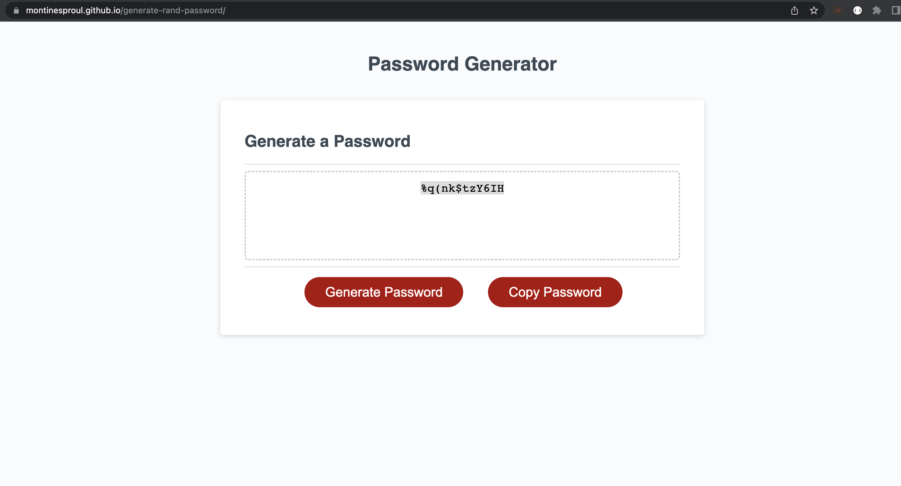

# Random Password Generator: JavaScript

## Description 
First I wrote out what the steps needed to be to be able to generate a random password.  
Then I started writing a conditional and going through each character type.     
I created variables to hold data like the different character types.    
I then created a for loop to cycle through all of the chosen character type and print it to the screen.   
I then realized that there is not effective way to copy the password once it is generated so I then added a copy button to enhance the user experience.   

## Screenshot of random password generated

### Github Pages Link
 https://montinesproul.github.io/generate-rand-password/